# Rich Text Editor - Visual Diagrams

These diagrams use Mermaid syntax and will render automatically on GitHub.

---

## System Architecture

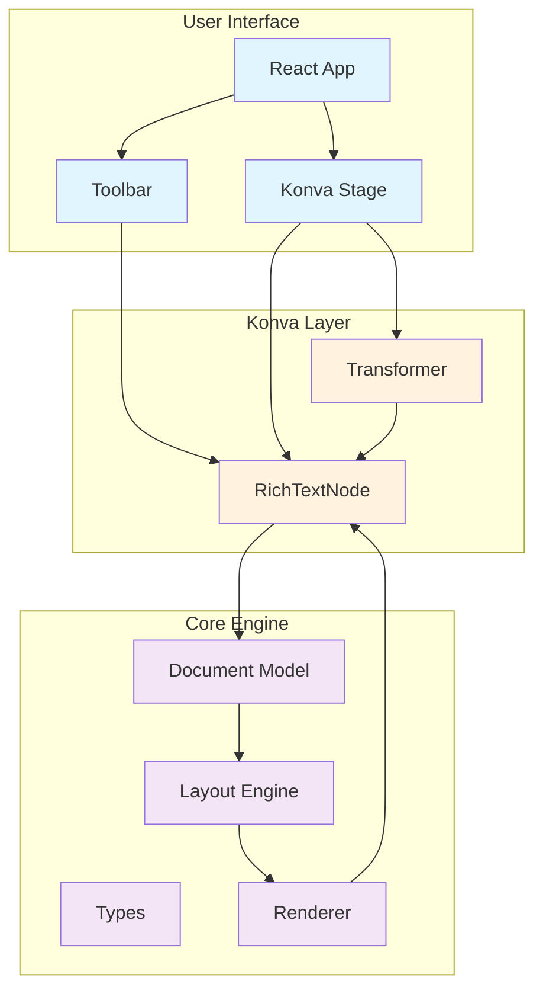

---

## Data Flow

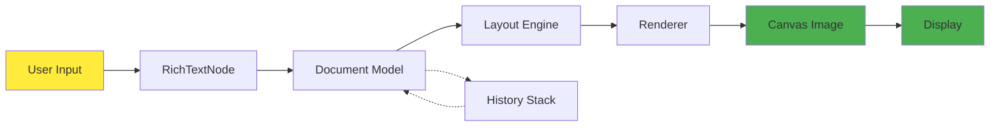

---

## Document Structure

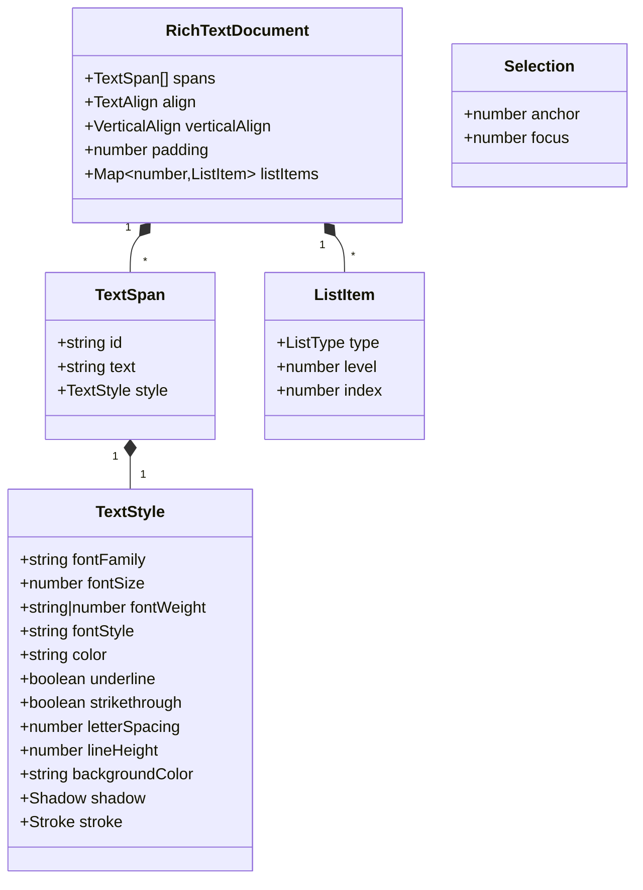

---

## Layout Pipeline

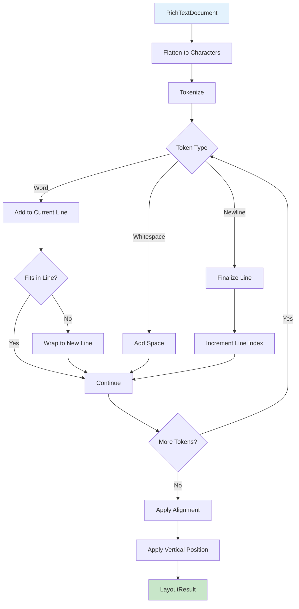

---

## Enter Key State Machine

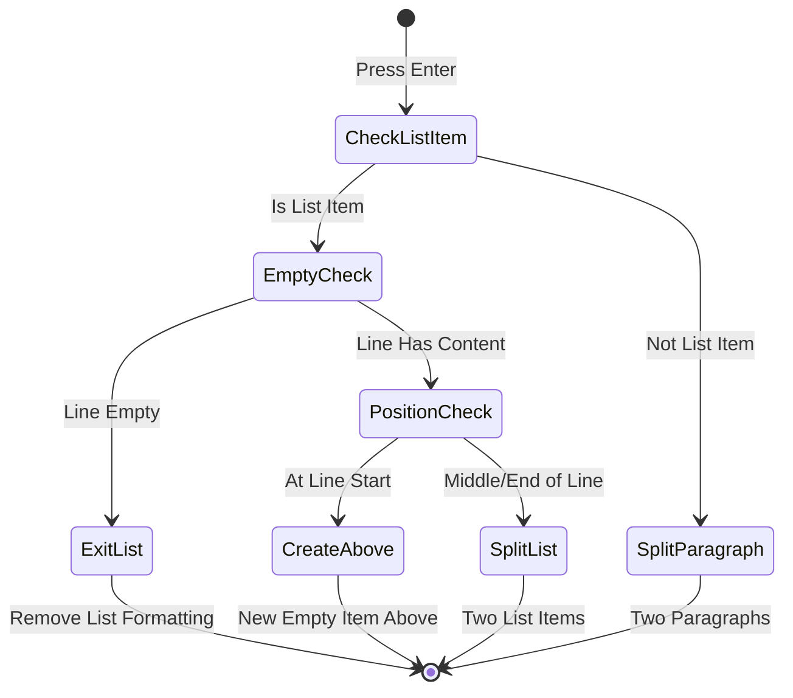

---

## Backspace Key State Machine

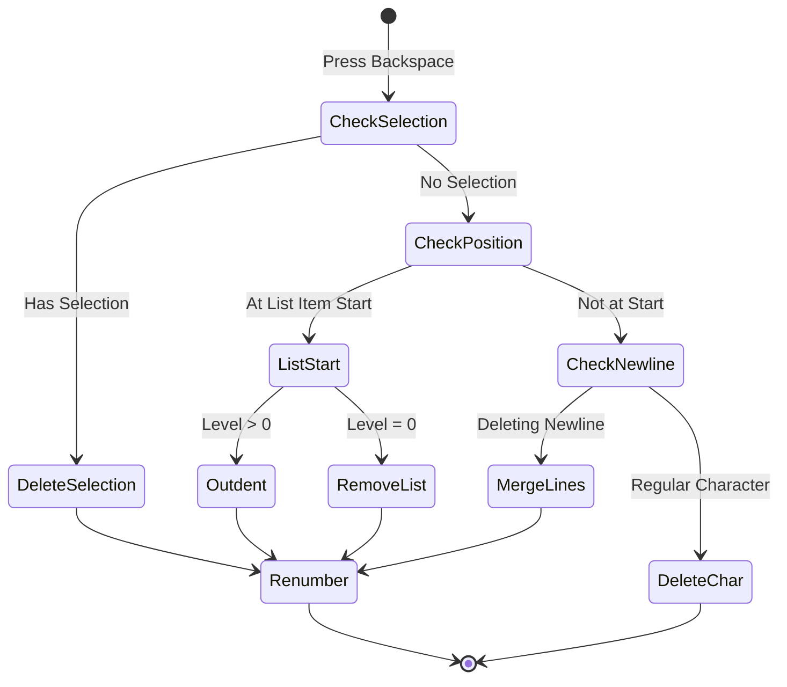

---

## List Nesting

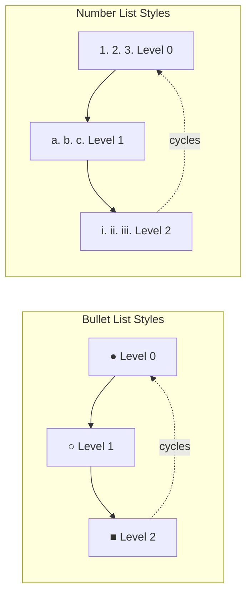

---

## Rendering Order

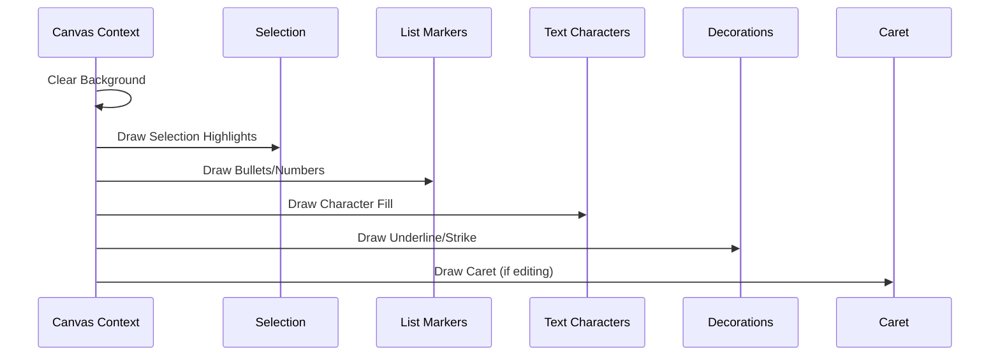

---

## Event Handling Flow

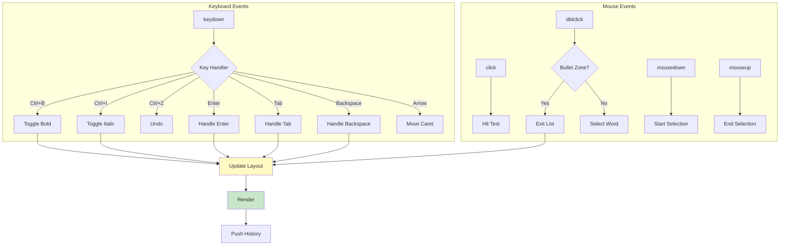

---

## History Management

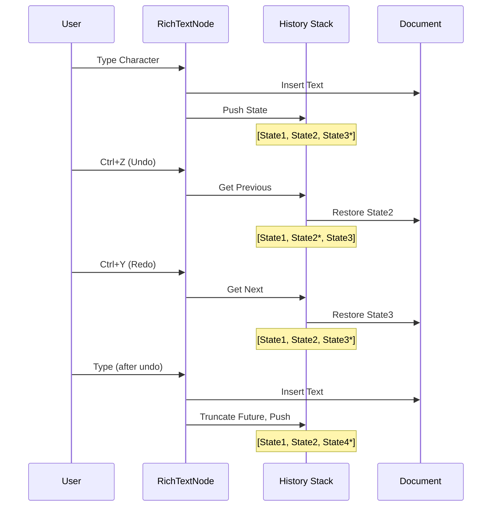

---

## Component Hierarchy

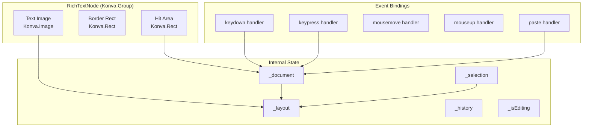

---

## Caret Position Logic

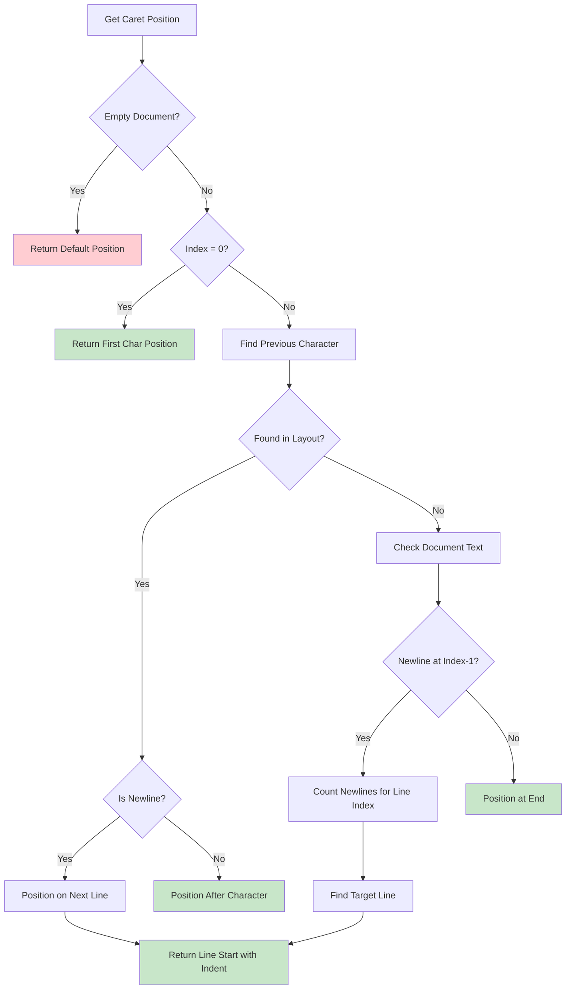

---

## Testing Coverage

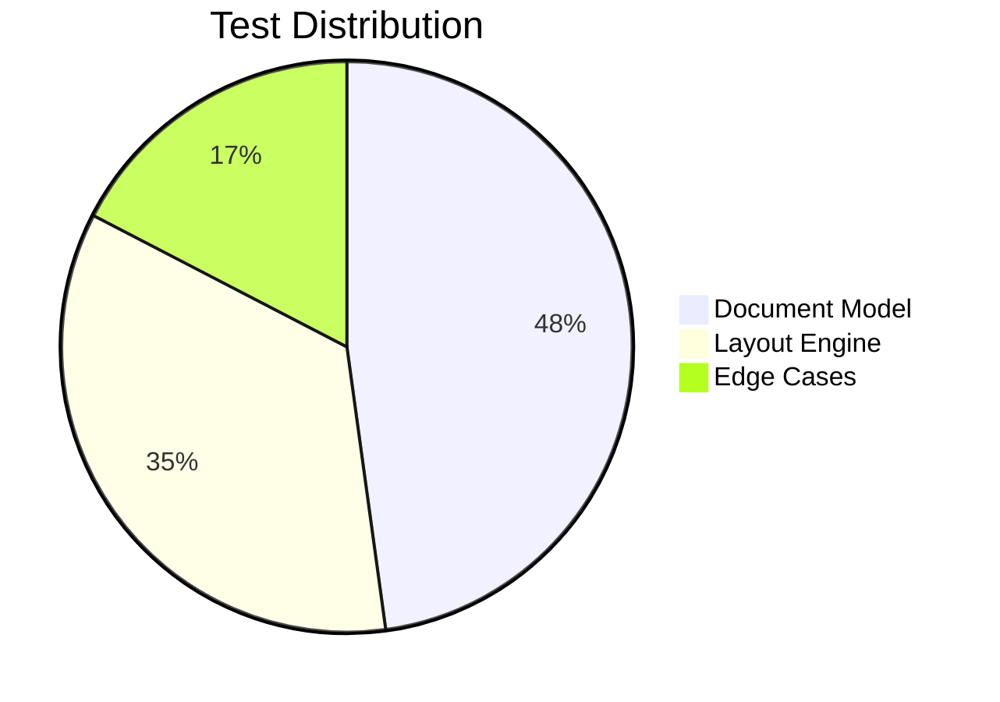

---

## Performance Optimizations

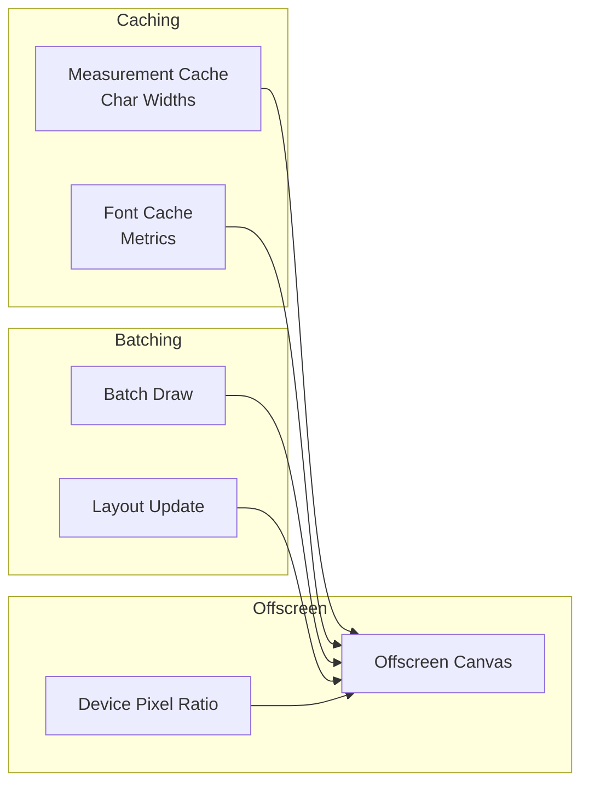

---

These diagrams provide visual representations of:
- System architecture and component relationships
- Data flow through the system
- State machines for key behaviors
- Rendering pipeline
- Event handling patterns

View on GitHub for automatic rendering of all Mermaid diagrams.
